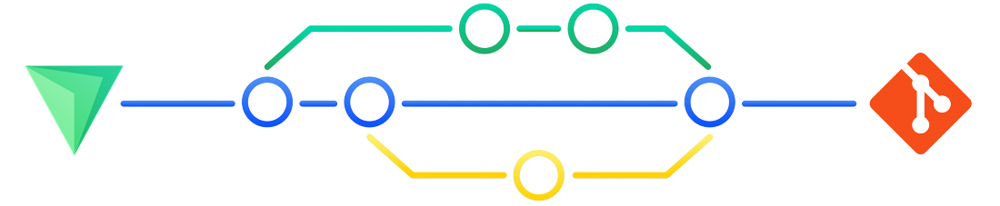

<table style="width:100%;height:auto">
<!--  === === === === --><!-- <tr align="center" width="100%"><td> -->
<!-- Announments --> <!-- [ Unlocked: 2, Left: 15 ] -->
<!-- <h1></h1> --> <!-- FIND THE SECRET -->
<!-- <h2></h2> --> <!-- RECEIVE THE KEY -->
<!-- <h3></h3> --> <!-- UNLOCK THE PRICE -->
<!--  === === === === --><!-- </td></tr> -->
<tr><td align="center">

  

<!--  
<a title="Z-Shell Projects" target="_self" href="https://github.com/orgs/z-shell/projects">-->

<!--</a>-->
  </td></tr><tr><td align="center">
  
  </td></tr><tr><td align="center">
    
    
    
    </td></tr>
<!--    <tr><td align="center">
        
      </td>
    </tr> -->
<tr><td align="center">

      
        
        
      </td></tr><tr><td align="center">
  <!--
  <h2 align="left">Internationalization and localization<h2>
      
  -->

<!-- Updating Translatiuons -->

</td></tr>
</table>
